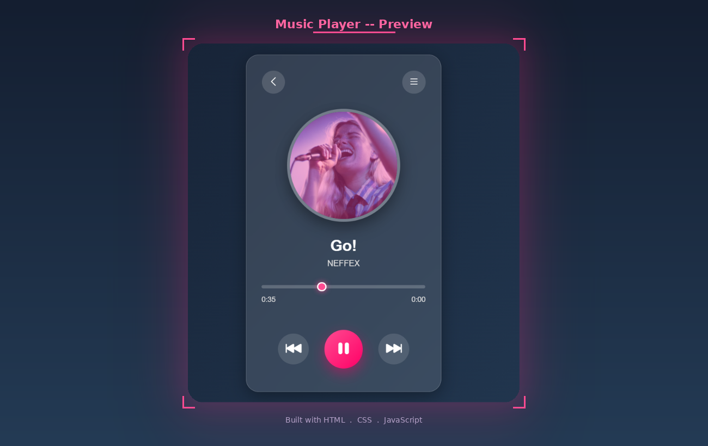

# Modern Music Player

A sleek browser-based music player built with pure **HTML**, **CSS**, and **JavaScript**. Features a glassmorphism card design, rotating album art, a live progress bar, and smooth play/pause controls.

---

## Preview



---

## Features

- Play and pause audio with a single click
- Album art rotates while the song is playing and pauses when stopped
- Live progress bar that updates as the song plays
- Seekable progress input to jump to any point in the track
- Displays current time and total duration in mm:ss format
- Glassmorphism card with backdrop blur and navy gradient background
- Pink glowing play button and progress thumb
- Responsive layout for mobile screens

---

## Project Structure

```
MusicPlayer/
├── index.html            # Markup and structure
├── style.css             # Styling and animations
├── script.js             # Audio controls and progress logic
├── preview.png           # Screenshot for README
└── Media/
    ├── Go! - NEFFEX.mp3  # Audio file
    └── 468-thumbnail.png # Album art image
```

---

## Getting Started

1. Clone the repo
   ```bash
   git clone https://github.com/your-username/music-player.git
   cd music-player
   ```

2. Add your audio file and thumbnail inside the `Media/` folder

3. Update the file references in `index.html`:
   ```html
   
   <source src="./Media/your-song.mp3" type="audio/mpeg" />
   <h1>Song Title</h1>
   <p>Artist Name</p>
   ```

4. Open in browser
   ```bash
   open index.html
   ```

---

## How It Works

When the song metadata loads, the progress bar max is set to the song duration. As the song plays, a `timeupdate` event continuously syncs the progress bar and current time display:

```js
song.addEventListener("timeupdate", () => {
  progress.value = song.currentTime;
  current.innerHTML = formatTime(song.currentTime);
});
```

The album art rotation is controlled by toggling a CSS class:

```js
songImg.classList.add("playing");    // starts rotating
songImg.classList.remove("playing"); // pauses rotation
```

---

## Customization

### Change accent color (pink to any color)
In `style.css`, replace `#ff4b91` and `#ff0066`:
```css
.play-btn { background: linear-gradient(135deg, #ff4b91, #ff0066); }
#progress::-webkit-slider-thumb { background: #ff4b91; }
.circle:hover { background: #ff4b91; }
```

### Change background gradient
```css
.container {
  background: linear-gradient(135deg, #141e30, #243b55);
}
```

### Change rotation speed
```css
@keyframes rotate {
  from { transform: rotate(0deg); }
  to   { transform: rotate(360deg); }
}
.song-img {
  animation: rotate 12s linear infinite; /* change 12s to speed up or slow down */
}
```

---

## Animations

| Animation | Effect |
|-----------|--------|
| `rotate` | Album art spins while the song is playing |
| Circle hover | Nav buttons scale up and turn pink |
| Control hover | All control buttons scale up slightly |
| Play button | Glowing pink shadow on the main play button |

---

## Color Palette

| Element | Color |
|---------|-------|
| Background | `#141e30` to `#243b55` navy gradient |
| Card | `rgba(255,255,255,0.12)` glassmorphism |
| Play button | `#ff4b91` to `#ff0066` hot pink |
| Progress thumb | `#ff4b91` pink with glow |
| Text | `white` and `#ddd` |

---

## Author

**Kaneeza Batool**
CS Undergraduate, Sukkur, Pakistan
Built with HTML, CSS and JS
